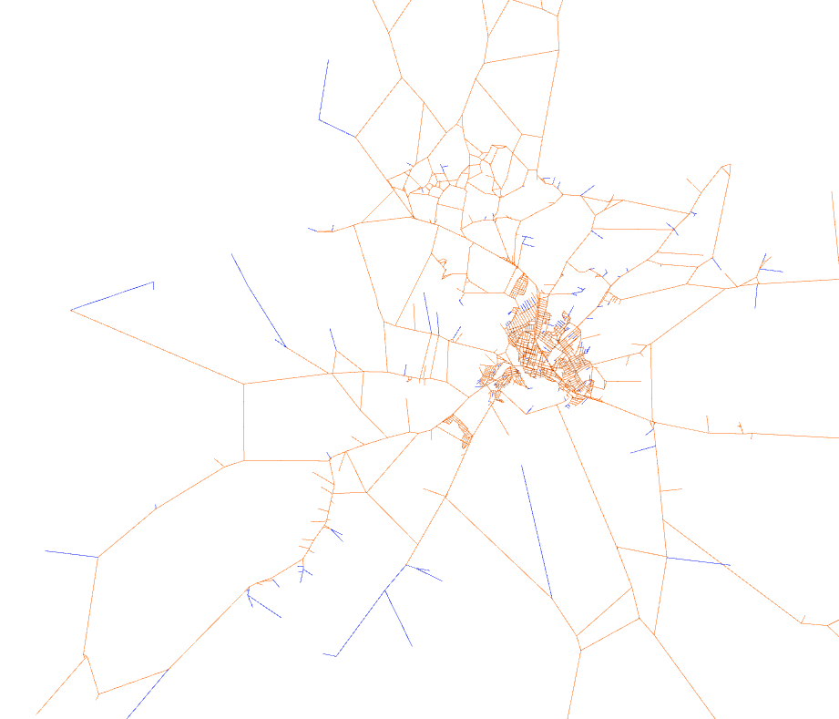
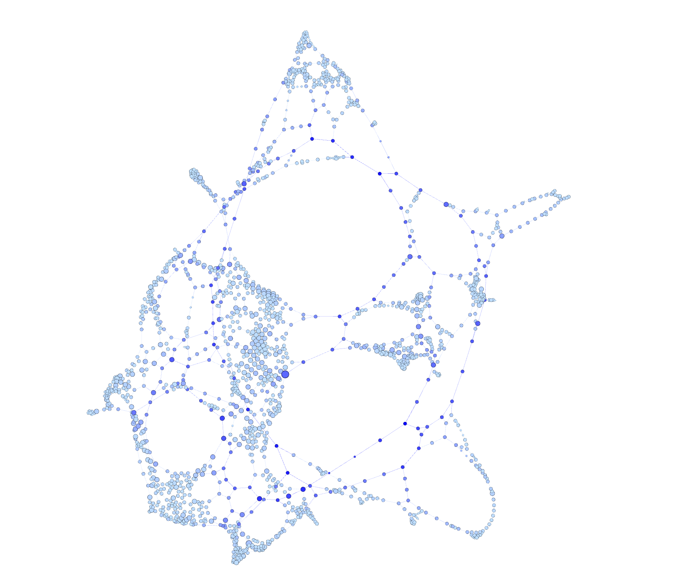

# Trabalho Prático – Estrutura de Dados II (DCA3702)
**Análise Estrutural de Redes Urbanas com OSMnx, NetworkX e Gephi**

---
## 📹 Apresentação em Vídeo
Assista à explicação da metodologia, código e análise visual no vídeo abaixo:
> **[🔗[ Link para apresentação do projeto](https://www.loom.com/looms/videos/AED-PROJETO-II-a15c53f4775e4cbf8e2dcd33e8ce2b6b)]**
---

## 🎯 Objetivo do Trabalho
O objetivo deste trabalho é modelar a rede viária da cidade de Santa Cruz (RN) como um grafo e aplicar métricas de análise de redes para compreender sua estrutura urbana. A análise busca identificar pontos de estrangulamento (gargalos de trânsito), as vias mais centrais, a conectividade geral do município e os cruzamentos mais importantes (hubs), facilitando o entendimento sobre a mobilidade local.

---

Este repositório contém o código, os dados gerados e a documentação referentes à análise topológica da malha viária urbana, utilizando conceitos de Teoria dos Grafos.

---

## 📍 Identificação da Região Analisada
**Localidade:** Santa Cruz, Rio Grande do Norte, Brazil  
**Tipo de Rede:** Viária (veículos/`drive`)  
**Grafo Original (MultiDiGraph):** 1984 nós e 5346 arestas  
**Grafo Convertido (Grafo Simples):** 1984 nós e 2783 arestas  

---

## ⚙️ Metodologia
O fluxo de trabalho foi dividido nas seguintes etapas:
1. **Coleta de Dados:** Utilização da biblioteca `OSMnx` para baixar os dados abertos do OpenStreetMap referentes à malha viária de Santa Cruz.
2. **Modelagem:** Conversão do grafo original (direcionado e com múltiplas arestas) em um grafo simples e não-direcionado utilizando `NetworkX`, viabilizando o cálculo de métricas clássicas.
3. **Cálculo de Métricas:** Aplicação de algoritmos estruturais para extrair Grau, Intermediação (*Betweenness*), Proximidade (*Closeness*) e K-Core.
4. **Tratamento de Atributos:** Limpeza dos metadados dos nós e arestas (como listas e dicionários aninhados no atributo `geometry` ou `osmid`) para compatibilização.
5. **Exportação e Visualização:** Exportação do grafo estruturado para o formato `.gexf` e posterior renderização e análise espacial no software **Gephi**.

---

## 📊 Métricas Calculadas e Resultados

### 1. Hubs (Grau dos Nós)
Os nós de maior grau representam os cruzamentos mais complexos ou rotatórias com mais saídas. Na região analisada, o maior grau encontrado foi **6**.
* **Top 1:** Nó ID `3964693509` (Grau: 6)
* **Top 2:** Nó ID `3964715642` (Grau: 5)
* **Top 3:** Nó ID `314993294` (Grau: 4)
* **Top 4:** Nó ID `1828181337` (Grau: 4)
* **Top 5:** Nó ID `2837621816` (Grau: 4)
* **Top 6:** Nó ID `2837621823` (Grau: 4)
* **Top 7:** Nó ID `2837621824` (Grau: 4)
* **Top 8:** Nó ID `2837621832` (Grau: 4)
* **Top 9:** Nó ID `2837621850` (Grau: 4)
* **Top 3:** Nó ID `2837621855` (Grau: 4)

### 2. Gargalos da Rede (Betweenness Centrality)
Mede a frequência com que um nó atua como ponte no caminho mais curto entre outros dois nós. Estes são os pontos de maior risco de congestionamento.
* **Top 1:** Nó ID `7428327102` (Score: 0.153927)
* **Top 2:** Nó ID `7410672473` (Score: 0.144247)
* **Top 3:** Nó ID `7413519201` (Score: 0.135714)

### 3. Vias Mais Centrais (Closeness Centrality)
Indica o quão rápido é possível alcançar qualquer outro ponto da cidade a partir de um nó específico. O nó Top 1 de Betweenness também é o de maior Closeness, indicando uma importância crítica na rede.
* **Top 1:** Nó ID `7428327102` (Score: 0.049233)
* **Top 2:** Nó ID `3964616875` (Score: 0.049055)
* **Top 3:** Nó ID `7429003086` (Score: 0.048988)

### 4. Coesão da Rede (K-Core)
A métrica de K-core permitiu avaliar a densidade e o núcleo rígido da cidade.
* **Maior core number:** 2
* O núcleo principal e mais coeso abrange **1643 nós** (aproximadamente 82,8% da rede), o que é típico de malhas viárias em cidades de interior, onde a estrutura predominante se assemelha a uma grade (grid) sem cruzamentos de altíssima complexidade geométrica.

---

## 🗺️ Principais Visualizações

*Nota: As imagens abaixo foram geradas através do Gephi utilizando o arquivo `santa_cruz_rede_urbana.gexf`.*

1. **Distribuição Geográfica de Santa Cruz - RN:**
   

2. **Distribuição Estrutural de Santa Cruz - RN:**
   

---

## 📝 Respostas às Questões Obrigatórias

### 1.  Os nós com maior grau coincidem com os nós de maior betweenness?
Não correspondem!
### 2. O núcleo identificado pelo k-core coincide com os principais hubs?

Sim, os principais hubs coincidem com o núcleo identificado pelo algoritmo de K-core, pois estão todos contidos nele. Contudo, essa coincidência se dá pela característica espacial da rede. O núcleo principal de Santa Cruz possui um core number máximo igual a 2, englobando 1643 nós (cerca de 82% da rede), o que na prática representa toda a malha urbana consolidada, excluindo praticamente as ramificações rurais.

### 3. O que a métrica de betweenness revela que o grau não revela?
O grau informa apenas a quantidade de ruas que se encontram em um ponto. Um cruzamento complexo ou uma rotatória com várias saídas terá um grau alto (ex: Grau 6). No entanto, uma via simples que seja a única ponte atravessando um rio ou rodovia para ligar dois grandes bairros terá apenas Grau 2 (uma entrada e uma saída), mas terá um betweenness gigantesco.

Se ocorrer um acidente e um nó de alto grau for bloqueado, os motoristas geralmente conseguem fazer pequenos desvios nas ruas adjacentes do mesmo bairro. Porém, se um nó de alto betweenness for bloqueado, o impacto é sentido em escala municipal. O betweenness revela quais pontos, se inativados, poderiam literalmente isolar partes da cidade ou causar colapsos e desvios quilométricos no trânsito.

### 4. O que muda quando a rede é analisada em sua posição geográfica real e quando é analisada por um layout estrutural?

O layout geográfico posiciona os nós através de coordenadas de GPS, mostrando a distribuição espacial real, a densidade de ruas e as restrições físicas do terreno. Já o layout estrutural organiza os nós com base em sua conectividade, nele a proximidade visual não indica que duas ruas estão fisicamente perto, mas sim que estão fortemente interligadas ou pertencem à mesma comunidade de fluxo. Isso permite enxergar o 'núcleo funcional' da cidade, destacando cruzamentos críticos no centro visual e empurrando vias isoladas para a periferia, revelando a verdadeira hierarquia de mobilidade da rede.

### 5. Existem regiões críticas para mobilidade urbana na área analisada?

Sim, a análise topológica revelou regiões altamente críticas para a mobilidade de Santa Cruz. O maior ponto de vulnerabilidade e estrangulamento da rede (gargalo) está localizado no nó 7428327102, que lidera isoladamente as métricas de Betweenness e Closeness Centrality. Isso indica que este ponto funciona como a principal artéria de ligação do município; uma eventual interdição nesta via forçaria o redirecionamento de quase 15% de todas as rotas de trajeto mais curto da cidade. Além disso, identificamos pontos de alta complexidade física, como os nós 3964693509 e 3964715642, que possuem graus 6 e 5, respectivamente, caracterizando cruzamentos ou rotatórias de intenso conflito de direções que demandam atenção especial no planejamento de tráfego.

### 6. A rede parece homogênea ou apresenta concentração estrutural?

A homogeneidade topológica é comprovada pela métrica de K-core, onde 82,8% da rede (1643 nós) pertence ao mesmo núcleo básico (Core 2), e pelo grau máximo baixo (6), indicando uma cidade com padrão de conectividade uniforme e sem trevos de alta complexidade.

Contudo, ao analisar a centralidade de Betweenness, nota-se uma clara concentração estrutural de roteamento. A existência de um nó por onde passam mais de 15% de todas as rotas mínimas da cidade demonstra que, embora as ruas tenham graus semelhantes, o tráfego é afunilado para gargalos específicos, criando uma forte dependência de poucas vias arteriais para a mobilidade global do município.

### 7. Os resultados obtidos fazem sentido considerando o conhecimento urbano da região escolhida?

Sim, os resultados fazem total sentido e refletem com precisão a realidade geográfica e urbanística da cidade.

---

## 💡 Principais Conclusões

A partir da modelagem e dos cálculos topológicos, conclui-se que:
1. **Centralidade Extrema:** A rede de Santa Cruz é altamente dependente de um grupo seleto de interseções. O nó `7428327102` se destacou liderando simultaneamente as métricas de *Betweenness* e *Closeness*, o que significa que é o principal ponto de convergência de fluxo. Um bloqueio neste nó afetaria drasticamente a mobilidade de toda a cidade.
2. **Malha Homogênea:** O grau máximo de 6 e um Core máximo de 2 indicam uma expansão viária conservadora e espaçada, sem a presença de estruturas complexas massivas típicas de metrópoles (onde os *cores* costumam ser bem maiores).
3. **Eficiência da Ferramenta:** A integração entre `OSMnx` para coleta, `NetworkX` para processamento algébrico e `Gephi` para espacialização demonstrou ser um pipeline robusto para análises de planejamento urbano e engenharia de tráfego.

---
**Desenvolvido para a disciplina DCA3702.**
